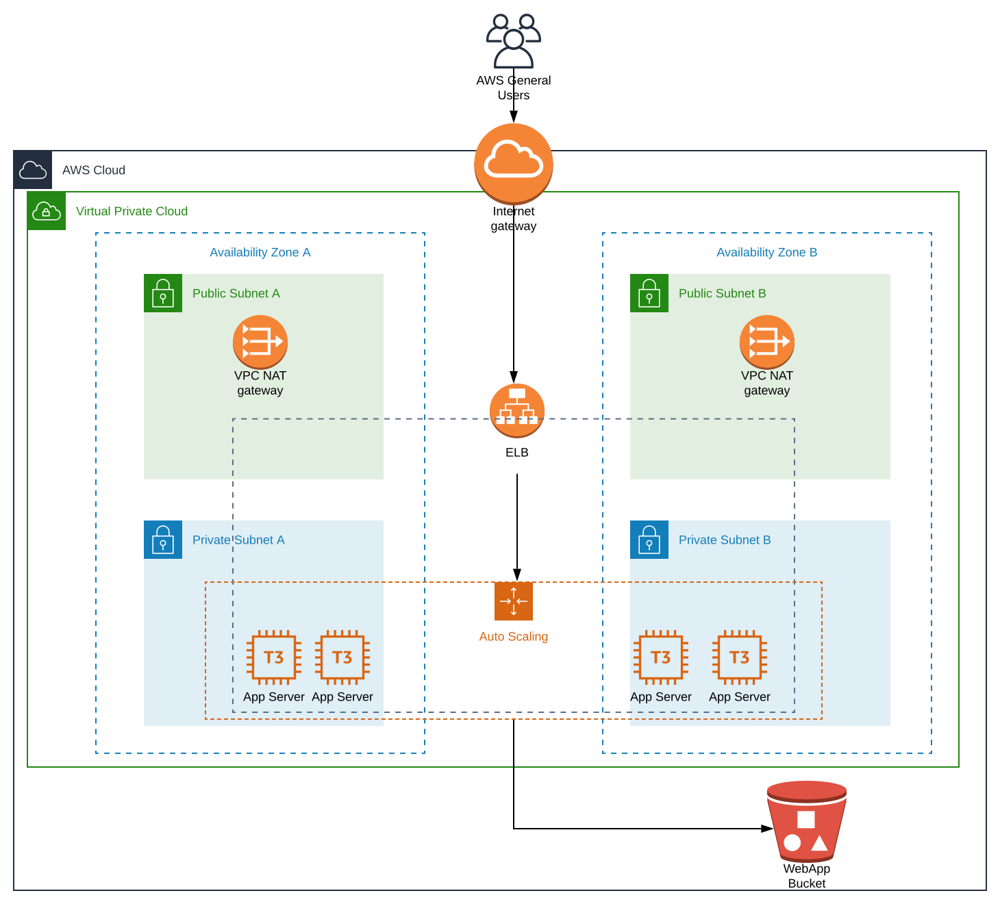
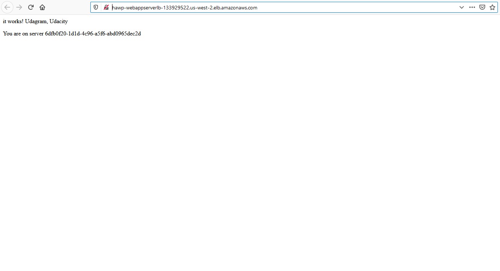

# High-Availability-WebApp-Project

An AWS CloudFormation script that deploys the infrastructure for a high availability web application as specified by [Udacity](https://www,udacity.com) for Cloud DevOps Engineer - project 2. 

## Specifications

Specifications as per Udacity course requirements can be found [here](./documentation/project_specifications.md).

## Infrastructure Diagram



## Prerequisites & Assumptions

- AWS account and appropriate credentials to deploy the script in its entirety. 
    - This script was developed and tested with the AdministratorAccess policy
- The AWS Cli installed and configured for your AWS account. 
    - This script was developed and tested with aws-cli v1.16.290.
- The setup scripts target AWS regions us-west2 by default and it is the recommendation region for deployment testing. Other regions may not have all the required AWS features.
- A BASH terminal to use the provided helper scripts. If using windows simply run the aws cli commands manually. 

## Usage Instructions

### Download Project Repo

Clone or download the project GIT repo to your AWS CLI workstation. 

***In the Repo***
hawp.yml - Main CloudFormation Template
hawp.json - Parameters file
create.sh - Helper script to create stack.
update.sh - Helper script to update stack.
README.md - This document
/documentation - Additional documents and diagrams
/website - Source files for the web app

### Setup S3 Bucket and Parameter Store

The UserData for the configured instances expects the web app source files to be located in a site.zip file stored in the root dir of an S3 bucket that is part of the same AWS account. The name of the S3 bucket is stored in Parameter store. This parameter store is then passed to the script as part of its CloudFormation parameters. The CloudFormation template will also create an appropriate role giving the EC2 instances permission to the S3 bucket. 

**Steps**

1. Create an S3 bucket in the target AWS account and region (Default us-west-2). Make note of the bucket name. 
2. Upload /website/site.zip from the project repo to the root of the newly created S3 bucket. 
3. In AWS Systems Manager - Parameter Store, create a new "standard" tier parameter of type "string" with the name of your choice (Script default name is "HAWP-Source").
4. For the value of the parameter enter the S3 bucket name and save. 

### Modify Parameters as Required

A parameters file has been provided as hawp.json. Here you can set the Parameter Store containing the S3 Bucket name (default "HAWP-Source"),  the environment name, VPC and Subnet IPs, instance type (default t3.medium) and instance ami (default Ubuntu Server 18.04 LTS).

The create.sh and update.sh helper scripts provided in the repo target AWS Region us-west-2 by default. You can edit these scripts to change the region if you wish however the CloudFormation template has only been tested on us-west-2.

### Deploy the CloudFormation Stack

Deploy the CloudFormation stack by running the create.sh helper script from the project directory. 

```./create.sh MyStackName hawp.yml hawp.json```

Replace `MyStackName` as desired.

#### Update CloudFormation Stack

If you make any changes to the template or parameters and would like to update your stack you can use the update.sh helper script. 

```./update.sh MyStackName hawp.yml hawp.json```

#### Verify the Web Application is running

To verify the web application is running as desired navigate to CloudFormation in the AWS console. The stack should say "CREATE_COMPLETE" if there were no errors. Select the stack and go to its "OutPuts" and look for the "LoadBalancerURL" key. Its value should be a link to the environment loadbalancer. Clicking on the link should take you to a page similar to the following. 



If you refresh the page several times you should notice the last line change. Each server in the AutoScaling group has been provided with a UUID it displays on the homepage. This easily verifies the Loadbalancer is cycling between instances. 


#### Secure Terminal Access to Instances

The environment has been configured to use AWS Systems Manager - Sessions Manager to allow remote terminal access to the webapp Server instances for troubleshooting/diagnosing. This eliminates the need of a bastion host and provides a host of other benefits of being an AWS managed service. 

##### Starting an session with an instance

***AWS Console***

In the AWS Management console navigate to the AWS Systems Manager service page. On the left of the page look for "Instances & Nodes" and click on "Managed Instances". You will see a list of the instances launched by the environment. Select the instance you wish to start a session with. Click "Actions" and "Start Session". You will be taken to a terminal emulation window and can issue commands as desired. 

*** AWS CLI ***

You can also start a session from the AWS CLI after installing the "Session Manager Plugin for the AWS CLI". Instructions on installing and using the plug-in can be found here: https://docs.aws.amazon.com/cli/latest/reference/ssm/start-session.html

#### Verify the ASG is working

You can verify the Auto-Scaling group is working with some quick tests. 

1. Terminate an instance and wait several minutes. In the AWS console you can monitor the Target Group and your EC2 instances to verify the missing instance is detected and a new instance spun up to take its place. 
2. Start a session with one of the instances and stop the with apache service with 'sudo systemctl stop apache2.service'. This leaves the instance running passing EC2 health checks but failing the loadbalancer website health checks. Wait several minutes and monitor the LoadBalancer, Target Group and EC2 instances in the console. The faulty instance will be detected, terminated and a new instance spun up to take its place. 